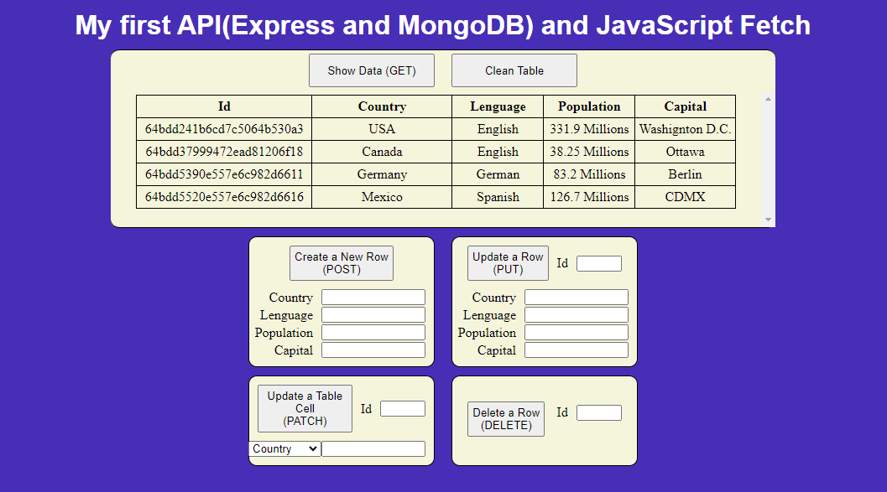

# This is my First API (Express and MongoDB) and JavaScript Method Fetch (GET, POST, PUT, PATCH and DELETE)
This project consists of a backend, which i made with Express and MongoDB, and a frontend, which i made with HTML, CSS, and JavaScript, which uses the JavaScript fetch method to make requests to the backend through the GET, POST, PUT, PATCH, and DELETE requests.

